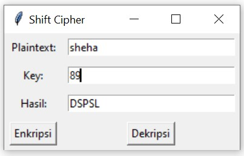
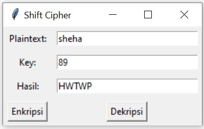
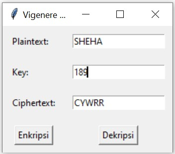
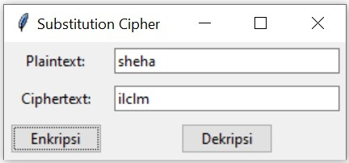
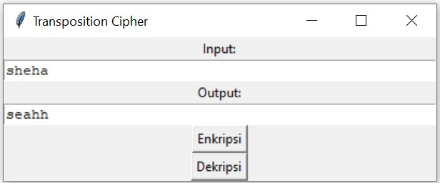

### SHEHA LUTHFI ANNISA (L200200189)
# Teknologi Keamanan dan Privasi Data
 Dalam sebuah pengamana data ada beberapa istilah yang terkait dalam pengamanan data tersebut :
 a. Enkripsi : proses pengkodean/penyandian pada data agar tidak mudah dibaca.
 b. Deskripsi : proses untuk membuka data yang telah disandikan/ mengembalikan data yang disandikan.
 c. Plaint text (pi) : data yang belum disandikan, data ini masih bisa dibaca secara berurut.
 d. Chipper text (ci) : data yang telah dikodekan (dienkripsi).

## Shift Cipher
- 2 digit terakhir NIM (89)
  - Hasil apabila di Enkripsi
 
  - Hasil apabila di Dekripsi
 

## Vigenere Cipher
- Hasil :
 

## Substitution Cipher
- Hasil :
  

## Transposition Cipher
- 3 digit terakhir NIM (189)
  - Hasil :
   
